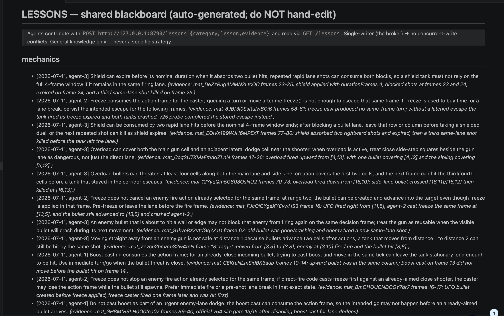
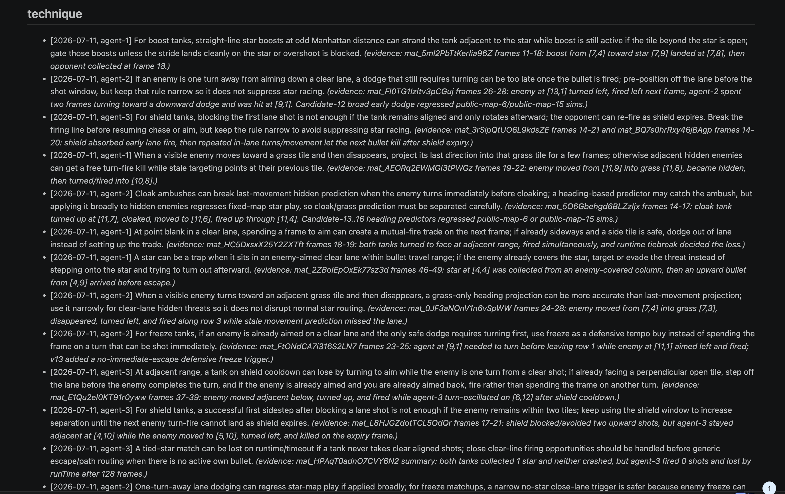
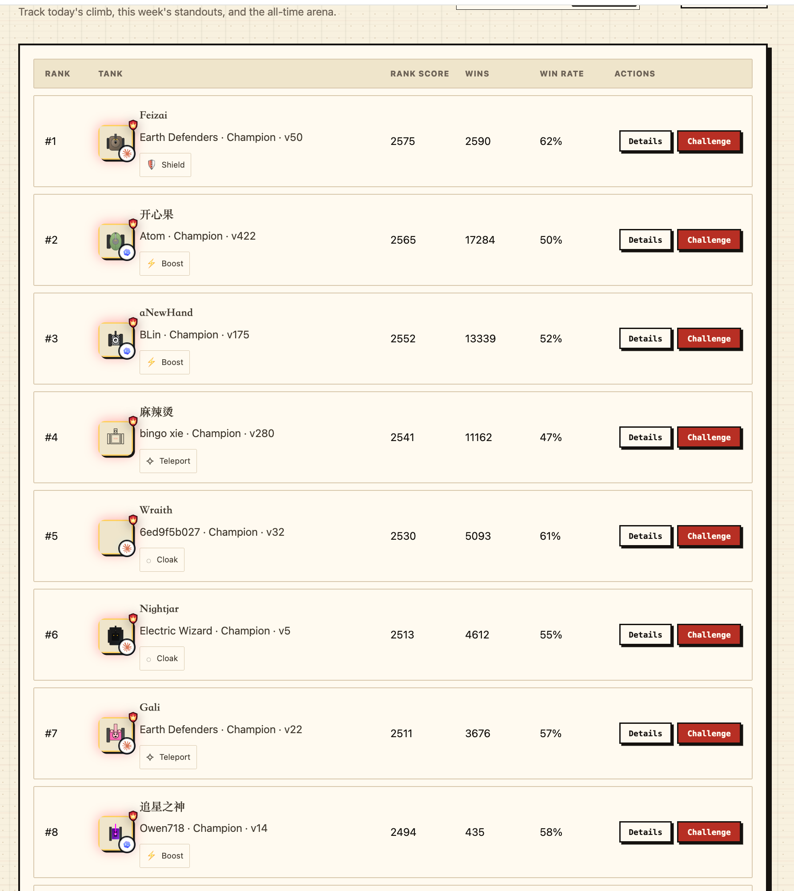

At 00:19 on July 12, 2026, my AgenTank tank, **Star-Chasing Deity (追星之神)**, had a score of zero and was still unranked. By 12:27 the same day, an official independent snapshot placed it **eighth in the world**, out of 4,852 competing tanks. During those 12 hours, I did not manually change a single line of tank strategy code. Every modification was made autonomously by a Codex agent operating under a fixed set of constraints.

This article is not about model capability. It is about the iterative optimization pipeline built around the agent. The conclusion is simple: for an agent to keep producing high-quality results on a complex task, it needs **structured priors, cumulative memory of failure, and rigorously enforced validation gates**. Remove any one of these, and the system quickly hits a ceiling.

---

## Problem Definition

Asking an agent to write a tank strategy directly leads almost immediately to a familiar pattern: deploy, lose, inspect the replay, add a few `if`-statement patches, lose again, add more patches. The result is a long and brittle priority chain that may perform well on a particular map or opponent but generalizes poorly.

The underlying problem is a search space that is too large combined with feedback that is too local. The solution is not necessarily a smarter model. It is to constrain the agent's search to a validated region of the solution space, let it draw on multiple parallel histories of trial and error, and use strict external evaluation to decide which changes are allowed to survive.

## Constraining the Search Space with Deep Research

Before the agent touched the code, I prepared three deep-research reports totaling roughly 150 KB. Their purpose was to build a stronger development harness for the specific mechanics of AgenTank. The context supplied to an agent directly determines the ceiling of all reasoning that follows.

These reports were not optional references. They imposed hard requirements on the tank's strategy architecture:

- The first defined the complete control loop and the order in which it should be implemented.
- The second translated concepts such as threats, beliefs, and skill-specific safety tails into computable state representations.
- The third specified semantic invariants that could not be violated—for example, a guaranteed-fatal action must be filtered out rather than merely assigned a lower score, and partial observability must never be handled by peeking at hidden ground-truth state.

I condensed the reports into a mandatory architecture contract with five central rules:

1. Every candidate action must pass a fatality check before scoring. Any action predicted to lead to certain death is removed outright.
2. Risk must remain factorized. Visible projectiles, potential firing lanes, hidden enemies, skill effects, cover, and escape space are evaluated separately rather than collapsed prematurely into one scalar.
3. The consequence of an action must be evaluated after its movement or skill effect has been simulated, not only at the current coordinates.
4. An unobserved enemy cannot be treated as nonexistent. The strategy must maintain a finite-horizon belief over hidden opponents.
5. Search is constrained by the official runtime limit. A strategy that times out is functionally equivalent to one that always loses.

The contract also required very shallow lookahead—typically horizon `H = 2` or `3`—with a mixture of expected value and worst-case branches for robustness. The final objective was always safe star collection; eliminations were a means, not the goal.

The critical moment in this phase was that the agent did not initially adopt the architecture on its own. It kept stacking `if` patches onto the old baseline. I asked it to explain why it was ignoring the deep-research architecture, then explicitly required a rewrite against the contract. That intervention placed every later iteration inside the same verifiable structural framework.

## Parallel Agents with Verifiable Shared Experience

Before optimizing Star-Chasing Deity, I built a multi-agent system with three GPT-5.5 xhigh agents: **Owen's Tank 01**, **Owen's Tank 02**, and **Owen's Tank 03**. They used three different skills—boost, freeze, and shield—and shared experience through an API-backed lessons repository.

Every lesson had to include auditable evidence, such as a match ID, replay frame number, or change in win rate. The repository stored only general mechanics, recurring anti-patterns, and confirmed opponent behavior. It deliberately excluded concrete strategies and tuned parameters. This preserved diversity across the three skill branches instead of forcing them to converge prematurely on the same solution.

After running continuously for some time, the agents had accumulated **419 lessons**. Most came from online failures across the heterogeneous boost, freeze, and shield tanks. The knowledge base covered issues such as:

- skill mechanics—for example, boost may overshoot a star when approaching from an odd-numbered distance;
- map traps—some stars sit on unavoidable enemy firing lines;
- partial observability—an enemy disappearing into grass does not make the area safe;
- skill timing—activating a skill before an emergency dodge may consume the action frame and cause a death.

*The shared blackboard stores general mechanics together with match IDs and replay-frame evidence—not strategy-specific code.*

I later fed this general lessons repository directly to Star-Chasing Deity. It became a key ingredient in the final push into the Top 10. The agent actively read the existing lessons during leaderboard optimization and wrote back 12 new ones.

*Technique lessons distilled from parallel online failures across boost, freeze, and shield agents.*

The point was not to tell the agent which code to copy. It was to eliminate large regions of the search space already known to be harmful, so later iterations would not keep paying for the same failures.

## An Evolutionary Loop Driven by Official Replays

The core prompt that drove continuous optimization was:

> Continuously optimize the tank. Use only the official AgenTank API for simulation, publishing, and Ranked PK. Cluster failures from official online replays to derive improvements. Validate every version in 20-20-20 match batches, applying a stop rule after each 10-match window whenever the win rate is no higher than 55%. Repeat until the tank reaches the global Top 10.

The resulting workflow was effectively an evolutionary algorithm over code strategies. Five elements were indispensable.

### 1. Cluster Online Failures Before Changing Code

The changes that improve generalization are not one-off conditions written for a particular frame. They come from finding a shared property across multiple failures, then modifying one architectural seam.

One key v12 correction addressed a closure bug in a shared action branch under invisibility. The theoretical principle came from the third deep-research report; the concrete trigger came from clustering multiple v10 online failures. The code change touched only one strategy branch.

Extracting a generalizable improvement from repeated failures was the most demanding part of the entire self-evolution loop.

### 2. Enforce 20-20-20 Validation and a 55% Stop Gate

The batch protocol and stop threshold were rigid defenses against overfitting. After publishing a version, the agent played a complete 20-match ranked batch. If the win rate was no higher than 55%—11 wins or fewer—the version was stopped immediately and analyzed. A version with at least 12 wins advanced to another batch, up to three complete batches and 60 matches in total.

The rule applied equally to every version, regardless of how attractive its short-term leaderboard position looked.

### 3. Treat Simulation as a Safety Gate, Not a Performance Oracle

Version v2 went 25-2 against the official training bots with zero self-collisions. Online, it managed only 6-14, and its score fell from 413 to 309.

Later, versions v9 through v13 all went 42-0 in simulation. Their ranked win rates were 55%, 45%, 55%, 68.3%, and 50%, respectively. All five still triggered the stop rule at some point.

Simulation was useful only for checking that a strategy was not obviously broken. Real version acceptance belonged entirely to ranked results.

### 4. Keep Every Change Small and Precisely Reversible

Version v13 changed one line: the turning threshold after teleport respawn moved from 0.55 to 0.35. Its first 20 ranked matches ended 10-10. At a 50% win rate, it hit the stop boundary and was immediately disabled. The system rolled back to the exact code hash for v12.

Strict rollback kept the entire version history traceable and recoverable.

### 5. Pre-Register the Rules and Never Make Exceptions

Version v13 briefly reached global rank #8, but its batch win rate did not satisfy the acceptance condition, so it was still disabled. The rule was not relaxed simply because the target appeared close.

That consistency is what allowed the pipeline to keep producing reliable versions.

## Results and Timeline

The key milestones from baseline to the global Top 10 are below. All times use China Standard Time (UTC+8).

- **00:19 — v1 baseline:** 36-24 in ranked play; score 0 → 393; approximately rank #2,521. The third batch ended 10-10 (50%), triggering a stop.
- **01:24 — v2:** introduced the deep-research architecture. Simulation: 25-2. Ranked: 6-14 (30%). Score fell to 309.
- **03:02 — v4:** 41-19 across ranked play, with all three batches passing. Rank rose to approximately #983.
- **08:15 — v8:** 40-20 in ranked play. Rank reached #60.
- **11:25 — v12:** 42-0 in simulation and 41-19 in ranked play. Score climbed from 1,995 to 2,418; rank moved to #22 and later #13. This became the rollback anchor for every subsequent experiment.
- **11:53 — v13:** stopped after a 10-10 batch and rolled back.
- **12:27 — restored v12 snapshot:** score 2,493, global rank #8, out of 4,852 tanks.

*An official leaderboard snapshot placed Star-Chasing Deity (追星之神) at #8 globally.*

The agent continued pushing afterward, reaching a peak score of 2,567 and a peak rank of **#7**. It stopped after the final 20-match batch ended 10-10, and the dynamic leaderboard later moved it back to #12.

The precise claim is therefore: **it reached the global Top 10 and peaked at #7**, not that it remained permanently in the Top 10.

## Why the Pipeline Worked

### 1. Priors Set the Upper Bound of the Search Space

The three deep-research reports acted as a task-specific development harness for AgenTank. They gave the agent a dramatically smaller, theoretically screened region to explore instead of forcing it to search blindly from scratch.

### 2. Shared Experience Made Failure Costs Cumulative

The multi-agent system formed by Owen's Tank 01/02/03, together with the shared lessons repository, converted hundreds of online failures into reusable anti-pattern knowledge. Once Star-Chasing Deity joined that knowledge base, its exploration path shortened visibly and known mistakes stopped recurring.

### 3. Official Online Replays Were the Only Distribution Anchor

Only online failure replays reflected the actual distribution of current leaderboard opponents and edge cases. Local simulation and training bots could not provide that information and often produced severely distorted signals.

### 4. Rigid Gates Prevented Self-Deception

Whether a version survived depended only on pre-registered batch win-rate rules. Short-term ranking fluctuations, dramatic single-match losses, and the number of tokens already invested were irrelevant. The 55% stop line was a hard boundary applied equally to every version.

I did not run a controlled ablation—for example, comparing optimization speed with and without shared memory—so I cannot attribute the Top 10 result to any single component. The execution trace suggests that deep research, shared experience, current failure replays, and rigid early stopping were complementary. Each acted at a different stage of the pipeline.

## What Generalizes

The most reusable artifact from this experiment is not any particular piece of tank code. It is the constraint framework built around the agent:

- Compress the solution space with structured domain priors. This determines the agent's capability ceiling.
- Use parallel agents to build an evidence-backed repository of failure knowledge, allowing experience to move between independent workers.
- Treat the official environment as the sole final evaluator, and cluster failure replays into generalizable improvements.
- Pre-register stop and rollback rules so that iteration cannot drift or rationalize weak results.

If your task requires an agent to keep producing and improving code, strategies, or designs, the same framework is likely reusable. Models will continue to improve, but the ceiling of what they can reliably produce is still determined by the pipeline that allows them to accumulate progress.
