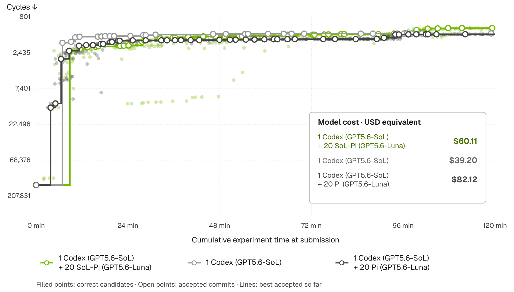

Over the past six months I worked on [SoL-Pi](https://nvlabs.github.io/SoL-Pi/), a project where coding agents searched for, implemented, and validated changes to their own harness. The project page covers the method and the results. This post collects what did not fit there: where we started, what failed first, and a few views on harnesses and multi-agent systems that formed along the way.

Some of what follows is backed by experiments. Some of it is opinion. I will say which is which.

---

## Where We Started: Self-Improvement on a Fixed Benchmark

In March 2026, the idea that an agent could improve its own harness was getting serious attention. Meta-Harness [Lee et al. 2026] let a coding agent propose harness changes while reading the code, scores, and traces of all earlier candidates. Self-Harness [2026] mined failure patterns from execution traces, proposed small edits, and accepted an edit only if it did not regress on held-out tasks. We spent the spring reproducing and extending this line of work internally. Two problems kept coming back.

**The search was unstable.** In our Meta-Harness-style runs, fewer than 5 out of 100 edits produced a real improvement. When almost every edit is noise, the selection step does most of the work. Selection on a fixed task set rewards anything that raises the score on that set, including rules that quietly encode the tasks themselves. Nobody needs to intend this. With enough candidates, benchmark hacking is what the search finds.

**The held-out check was weaker than it looked.** Self-Harness splits Terminal-Bench 2 into an optimization part and a held-out part. This is much better than no split. But both halves come from the same benchmark: the same task authors, the same container conventions, the same style of verifier. A gain on the held-out half shows that a change generalizes inside that distribution. It says little about whether the change helps on a user's repository.

We concluded that the objective mattered more than the search algorithm. If the objective is "score on this task set," a capable optimizer will eventually learn the task set.

## Choosing an Objective That Does Not Depend on the Task

We changed the objective to **token efficiency**: API cost per unit of task score, subject to a capability floor.

The reason is that most of the waste this objective targets comes from the harness, not from the task. The same context gets re-sent on every request. The model spends a turn reading an edit receipt before issuing a test command it had already decided on. A 200 KB build log is re-transmitted on every later request. These patterns appear whether the agent is writing a SQLite WAL parser or a Raft cluster. A mechanism that removes them has a reason to transfer that does not depend on having seen the target tasks.

Efficiency has its own shortcut: an agent can spend fewer tokens by doing less. So capability works as a gate. Every capability metric must stay within a tolerance declared before the search starts, and only then does an efficiency gain count.

The second requirement was strict isolation between search and evaluation:

- Search ran on 535 environments: 495 derived from GitHub issue–PR pairs, and 40 open-ended, verifier-driven tasks with graded scores in [0, 1].
- EdgeBench [Seed 2026] stayed out of the search entirely. Frozen candidates were evaluated once. A failure rejected the candidate, and no result flowed back into the loop.

The third reason was practical. An efficiency gain reaches users directly as a smaller bill for the same agent. We wanted the output of the research to be something people could install.

After 152 research directions, more than 3,000 runs, and more than 60,000 agent interactions, four mechanisms survived. On EdgeBench with GPT-5.6 Sol, the combined stack cut token traffic by 49.0% and API cost by 33.2% relative to Pi, while keeping 93.7% of Pi's score. Applied to Opus 5 without any further search, it cut token traffic by 44.7% and API cost by 33.5%, keeping 94.3% of the score. The savings are not free everywhere: on Terminal-Bench 4, solved tasks dropped from 18 to 15 while cost fell 26.3%. I think a trade-off stated plainly is more useful than one left out.

## Why Pi

We chose [Pi](https://github.com/earendil-works/pi) as the starting point for four reasons.

1. **Its core is small.** Read, write, edit, and bash, plus an extension system. An agent can understand the whole harness before changing it.
2. **It performed better than we expected.** In broad internal testing, Pi outperformed the native harnesses we compared against on several benchmarks. We were not starting from a weak baseline.
3. **It was built to be modified by agents.** Armin Ronacher describes the design goal as "agents built for agents building agents": the agent can "write code, reload, test it and go in a loop until your extension actually is functional" [Ronacher 2026]. That is exactly the loop a self-improving harness needs.
4. **It has real users.** Improvements to Pi reach an existing user base, not only a paper.

## Should Harnesses Get Thinner as Models Get Stronger?

A common view holds that as models improve, the harness should shrink: anything the model can do on its own should be removed. I think this view mixes up two questions. One is whether the model *can* complete a task with basic operations. The other is whether that is the *most efficient* way to complete it.

Processors are a useful comparison. Any computation can be expressed in a small instruction set, yet processors still ship vector units and dedicated cryptographic instructions, because the specialized path is much cheaper for common workloads. The long argument about instruction set design was always about which specializations earn their cost. Nobody doubted that the basic set was sufficient. The same trade-off applies to harnesses: simplicity has real value, but it is not proof of the best design.

SoL-Pi gives a concrete case. Without any new tool, a model can edit a file, read the result, and then issue a test command. But the middle turn carries no decision, because the test command was known before the edit. **Action Fusion** lets the model specify an edit and a follow-up command in one call. The harness runs both and returns both results together. An oracle analysis over our trajectories projected that full use of this pattern would remove 10.8% of model turns and 11.5% of tokens. The model was fully capable of the unfused version. The harness made it cheaper.

The same experiments also show why a fixed harness is an incomplete answer. How useful a mechanism is depends on the habits of the model using it. Among tasks where it triggered, Action Fusion fired 70.58 times per task on GPT-5.6 Sol and 13.54 times per task on Opus 5. Online Context Compact triggered on 92.2% of tasks with Sol and 33.3% with Opus 5. A mechanism fixed at design time fits one model's working style better than another's.

So the useful question is which complexity pays for itself, for which model, measured on the cost of the whole task. The size of the harness does not answer it.

There is a second possibility that the "thinner harness" view leaves out. It assumes one path: the model absorbs capabilities that used to live in the harness. Another path is that a stronger model gets better at *building* tools for the task in front of it, from basic operations. All four SoL-Pi mechanisms were proposed, implemented, and validated by agents. That is a small example, but it changes the question. Besides asking "can this be left to the model," we can ask "can the model build a better tool than the one we wrote in advance."

This suggests a structure: a small, stable core of basic operations, with task-specific tools composed on top and refined with experience. The core stays simple, and the complexity lives where it can change. The same idea extends to multi-agent systems. Agents with different roles do not need identical harnesses, and each member's harness could adapt to its role and to the stage of the task.

## What Counts as Progress in Recursive Improvement

Two easy measures of recursive improvement are misleading.

**The number of iterations.** Another round is cheap to run. What matters is whether the round produced something that was out of reach before: a solution to a problem the system could not solve, a mechanism that survives held-out evaluation, or training data of higher quality. In SoL-Pi, about 1 in 40 initial ideas survived validation. Depth-first refinement of a single idea tended to settle into small variations of the same design after 5–10 rounds with GPT-5.6 Sol. The survivors came from breadth, meaning more independent starting points. This is a qualitative observation. We did not run an equal-budget comparison between the two strategies.

**Whether the artifact lasts.** "The base model will learn this anyway" is often used to dismiss harness research. Two questions are mixed together here: whether a specific implementation will last, and whether it helped produce a capability that did not exist before. A harness can help a system solve a class of problems. Those solutions become training data, the model learns them, and the harness becomes unnecessary. That is the process working as intended. It also means a research group does not need to train the largest model to study how models improve. A method that reliably produces new, high-quality results is a contribution even if someone else does the training.

**Efficiency may compound.** The next step we plan is to use SoL-Pi as the starting harness for the next round of auto-research. If each run costs a third less, a fixed budget covers more environments, trajectories, and ideas. The optimized object then includes the process of finding the next optimization. This is a research direction. We have not shown that the gains accumulate over multiple rounds.

## More Agents Means More Spending

In the SoL-Pi swarm experiment, a coordinator and 20 workers optimized a kernel for two hours. The SoL-Pi swarm reached 1,127 cycles at $60.11. A swarm of plain Pi workers reached 1,366 cycles at $82.12. A single agent reached 1,333 cycles at $39.20, the lowest cost of the three. Twenty-one agents bought about 15% fewer cycles than one agent. Whether that is worth the extra spend depends on the problem.

*Best accepted cycle count over two hours (lower is better). Green: 1 Codex coordinator with 20 SoL-Pi workers. Light gray: a single Codex agent. Dark gray: 1 Codex coordinator with 20 Pi workers.*

Adding agents adds input. The return depends on whether members explore different directions, whether one member's finding saves others from repeating the work, and how much coordination costs. We have seen settings where the gain from more agents was small and the communication overhead was large. Scaling the number of agents is not, by itself, a research plan. The question to answer is which forms of cooperation turn extra spending into extra progress.

Communication should be judged the same way. In our runs, adding communication sometimes raised the tokens spent per round but reduced the number of rounds, and the total went down. A message is worth sending if it makes later work more effective. Counting the tokens in the message does not tell you that.

Different agents can also use different models. Combining models from different vendors is a space where independent researchers have an advantage, because a vendor optimizing its own product has little reason to make a competitor's model work better. In general, the opportunities that last are the ones where our goals differ from the vendors' goals. Problems the vendors simply have not solved yet tend to disappear once they put resources in.

## Closing

Three things from this project I would keep:

- Search finds whatever the evaluation rewards. Keep only the changes that still help on tasks the search never saw.
- Judge a harness by the quality and cost of the whole task. Its size proves nothing either way.
- Measure recursive improvement by the new results it produces. The number of rounds proves nothing either way.

*RSI for Efficiency. Efficiency for Swarm Intelligence.*

---

## References

[1] SoL-Pi project page. <https://nvlabs.github.io/SoL-Pi/>

[2] Lee, Y., Nair, R., Zhang, Q., Lee, K., Khattab, O., and Finn, C. "Meta-Harness: End-to-End Optimization of Model Harnesses." arXiv:2603.28052, 2026.

[3] "Self-Harness: Harnesses That Improve Themselves." arXiv:2606.09498, 2026.

[4] Ronacher, A. "Pi." 2026. <https://lucumr.pocoo.org/2026/1/31/pi/>

[5] ByteDance Seed. "EdgeBench." arXiv:2607.05155, 2026. <https://github.com/ByteDance-Seed/EdgeBench>

[6] Weng, L. "Harness Engineering for Self-Improvement." Lil'Log, 2026. <https://lilianweng.github.io/posts/2026-07-04-harness/>
