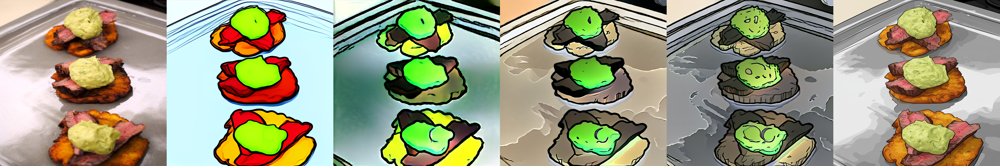

## Introduction

Realtime editing is harder than offline generation. Average speed is not enough—the system must deliver low-latency, stable outputs consistently enough for humans to stay in the loop.

This project pushes FLUX2-based image editing into that regime. Three tracks: inference acceleration to make serving fast; architectural adaptation to reshape the model for causal editing; and reinforcement-learning-based distillation to compress the step budget without quality loss.


*The realtime editing feedback loop: input image, text instruction, and reference flow into the latent diffusion model, producing edited output. The constraints—low latency, high stability, high editability—must all hold for the system to feel interactive.*

> **Preview Notice:** This post describes a partially integrated system. Latency and FPS numbers reflect the current inference stack only; causal attention distillation and reward-guided DMDR are validated separately but not yet fully integrated.


---

## Realtime Editing as a Systems Problem

The target is end-to-end latency under product constraints: the model must react quickly, outputs must stay stable across consecutive edits, and edit fidelity must hold. A 40ms result that ignores instructions is not fast—it is broken.

This framing filtered out many optimizations that improved isolated benchmarks but not the actual product.

### Representative Runtime Breakdown

On a single H100, a representative optimized two-step configuration reached the following stage breakdown:

| Stage | Latency (ms) | Share |
|-------|-------------|-------|
| Prepare | 12.60 | 18.9% |
| Denoise | 36.10 | 54.3% |
| Decode | 17.82 | 26.8% |
| **Total** | **66.52** | **100%** |

This corresponds to **15.03 FPS**. It is not the fastest configuration—denoise still dominates, while prepare and decode remain too large to ignore. This decomposition shaped the engineering decisions that follow.

With the more aggressive FA3 + TAEF2 + compile stack, the best measured runtime improved further to **53.55 ms (18.67 FPS)**—detailed later in the VAE optimization section.

---

## Inference Acceleration: Cache for Two-Step Editing

The biggest win came from caching—specifically, DBCache from Cache-DiT. With only two denoising steps, every unnecessary block execution is proportionally expensive.

**Key implementation choices:**

1. **Step-aligned masking**: The cache aligns with the two-step regime using mask `"10"`—first step computed fully, second step allowed to reuse cached activations.

2. **Dynamic thresholding**: A residual-difference threshold gates cache reuse. Lower thresholds are safer; higher thresholds are faster.

3. **TaylorSeer calibration**: Acts as a local correction mechanism for the skipped-compute regime.

4. **Per-request refresh**: `refresh_context(...)` is mandatory—stale cache state in realtime serving leads to incorrect reuse decisions.

Cache attacks the full denoising path rather than individual operators. It reduced wasted work and lowered variance on the prepare side once per-request state and latent packing stabilized.


---

## Inference Acceleration: Faster Kernels and Runtime

With cache in place, the next target was operator speed. This was not just optimization—it was a **serving-path refactor**: dismantling the default Diffusers offline pipeline and reorganizing it into a realtime-serving-oriented path.

### Attention Backend Selection

The attention backend optimization was not just about picking FlashAttention 3. It was about making backend selection robust enough for production: FA3 → Sage → Native automatic selection, Diffusers attention dispatch compatibility patching, runtime probing to verify the interface actually works, and graceful fallback if anything fails. The fastest backend is only the fastest if it does not crash the service.

### Selective Compilation

`torch.compile` is applied selectively for stability: transformer at load time; VAE encoder and decoder separately. If a compiled branch fails at runtime, the system drops to eager mode for that branch only. This is not "compile so it runs faster"—this is selective compile with per-branch fallback, prioritizing serving stability over benchmark speed.

### VAE Optimization

At low step counts, VAE encode/decode become significant latency fractions. TAEF2 provides a faster VAE replacement.

### Results

**Attention backend comparison:**

| Backend | Total (ms) | Prepare (ms) | Denoise (ms) | Decode (ms) | FPS |
|---------|-----------|--------------|--------------|-------------|-----|
| SageAttention | 79.03 | 21.95 | 36.90 | 20.18 | 12.65 |
| **FlashAttention 3** | **64.49** | **13.30** | **33.70** | **17.49** | **15.51** |

**VAE compile impact:**

| Encoder compile | Total (ms) | Prepare (ms) | Decode (ms) | Denoise (ms) | FPS |
|-----------------|-----------|--------------|-------------|--------------|-----|
| Off | 74.90 | 15.16 | 18.67 | 41.08 | 13.35 |
| **On** | **66.52** | **12.60** | **17.82** | **36.10** | **15.03** |

**TAEF2 VAE path (with FA3):**

| VAE path | Total (ms) | Prepare (ms) | Denoise (ms) | Decode (ms) | FPS |
|----------|-----------|--------------|--------------|-------------|-----|
| Baseline VAE | 70.40 | 16.82 | 34.69 | 18.89 | 14.21 |
| TAEF2 eager | 56.79 | 12.54 | 33.63 | 10.63 | 17.61 |
| **TAEF2 + compile** | **53.55** | **11.94** | **33.69** | **7.91** | **18.67** |

The denoise cost barely changed across TAEF2 variants—attribution is clean: the gain is VAE path shrink, not side effects in the diffusion loop.

### Serving-Path Refinement

The serving-path refactor continued beyond the major components. Beyond cache, kernels, and VAE, I rewrote much of the runtime glue around Diffusers to better match the realtime serving path. None of these changes was flashy alone, but together they made the pipeline a true realtime system rather than a repackaged offline diffusion pipeline:

| Optimization | Description |
|-------------|-------------|
| **Prompt caching** | Prompt embeddings and text IDs cached and reused when the prompt stayed the same; removed repeated text-encoding overhead in interactive editing. |
| **Fast image preprocessing** | Replaced generic preprocessing with a faster PIL → NumPy → Torch path; kept pin-memory and non-blocking H2D transfer for lower input overhead. |
| **Latent packing cleanup** | Rewrote latent preparation, packing, and multi-image conditioning assembly; removed unnecessary tensor reshaping and reduced recurrent allocation. |
| **Timestep caching** | Timestep retrieval cached by latent sequence length, step count, and device; avoided rebuilding schedules on repeated requests. |
| **Image latent-ID caching** | Latent IDs cached by shape and device, reducing repeated conditioning-path preparation. |
| **Multi-reference handling** | Main image on compiled VAE encode path; reference images forced through eager encode to avoid compile stalls from resolution mismatch. |
| **Custom decode path** | Split out latent unpacking, normalization, unpatchifying, and VAE decode for cleaner compilation, profiling, and recovery. |
| **Serving behavior** | Latest-frame overwrite strategy—prioritizes newest useful frame instead of faithfully processing stale ones. This is product-shaped optimization: in realtime editing, returning an outdated result is worse than skipping a frame. |
| **Binary transport** | Reduced avoidable transport overhead with binary endpoints (`/api/predict_binary`, `/ws/predict`) instead of base64—reminding that not all latency lives inside the model. |


---

## Training Acceleration: Attention Distillation for Causal Editing

The first training track changed the model's attention geometry. The second would change the optimization target.

Inference optimization alone hit a structural limit. FLUX2-4B-Klein was built for full in-context learning—powerful, but not optimal for realtime editing where you want efficient information flow from instruction and reference into editable image tokens.

The solution: distill the full-attention teacher into a causal-editing student with an asymmetric editing mask.

### What Did Not Work

- **Output-level distillation alone**: The student matched denoising targets but failed to inherit correct editing behavior under the new mask.
- **Naive attention distillation**: Matching generic internal features is insufficient when information flow architecture changes.

### What Worked

The supervision site matters. The final setup uses two signals:

1. **Output distillation**: Student predicts the denoising target; penalized for deviation from teacher velocity.
2. **Attention-feature distillation at image tokens**: Forward hooks collect attention outputs from double-stream and single-stream transformer blocks; loss applied only to image-token slices where editing behavior forms.

Matching only final outputs was too weak. Matching wrong internal features was too diffuse. Matching the right attention outputs transferred causal editing behavior.

This bridges training and deployment cleanly: the more the model internalizes efficient causal editing paths, the less the serving system fights the architecture.

Evidence is behavioral—one-step vs two-step ablations, copy-paste and structure-transfer tests, baseline comparisons, and controllability after mask change—rather than single scalar benchmarks.


---

## Training Acceleration: DMDR with Pair-Wise Reward

Once in a causal editing regime, the question becomes: how to push the model into a very small step budget without training against a misaligned objective?

### DMDR Structure

DMDR keeps the standard DMD structure but makes generator updates more suitable for low-step editing. The critical difference is reward integration.

Traditional preference pipelines use reward models as outer-loop evaluators—sparse terminal scalars. Editing needs dense signals.

### Pair-Wise EditReward

A pair-wise EditReward model (Qwen3.5-9B backbone) is trained on high-quality editing preference data. Given source image, generator output, baseline candidate, and edit instruction, it answers: is candidate A better than candidate B for this edit?

Pair-wise structure is sharper than absolute scoring for editing. More importantly, the reward is wired as a direct differentiable loss:

```
total_gen_loss = loss_gen_dmd + reward_loss
```

The gradient flows through the generated image into the generator. The reward model does not just score samples—it acts as a semantic teacher through the image manifold.

### Why This Matters

Pure distillation caps the student at teacher quality. But the teacher may not be optimal for the low-step, deployment-shaped objective. The reward model introduces a second supervision axis: the teacher provides stability; the reward model pushes toward better edits under the target criterion.

The qualitative comparisons below show source image, stronger/weaker FLUX2 variants, plain DMDR, reward-guided DMDR, and Nanobanana results under identical prompts and 2-step settings.



*All results use the same prompt, same 2-step budget, and same evaluation setup.*

DMDR turns preference modeling from a sparse outer-loop evaluator into a dense inner-loop training signal—what a low-step realtime editor actually needs.


---

## Summary

Realtime editing requires optimizing the whole system, not a bag of tricks.

- **Inference**: Gains came from cache-aware two-step editing, stable backend selection, and eliminating unnecessary work. The best measured runtime reached **53.55 ms (18.67 FPS)** on a single H100.

- **Model**: Reshaping the architecture into a causal editor, then using reinforcement learning to align distillation with the right outcomes.

- **Integration**: The systems and training work were different paths toward the same constraint—making realtime interaction the primary design target from day one.

Realtime editing did not emerge from a single breakthrough. It emerged from making the whole stack obey the same constraint.

> **Note:** Speed numbers reflect the current inference stack only; final integrated performance with causal attention distillation is still in progress.
